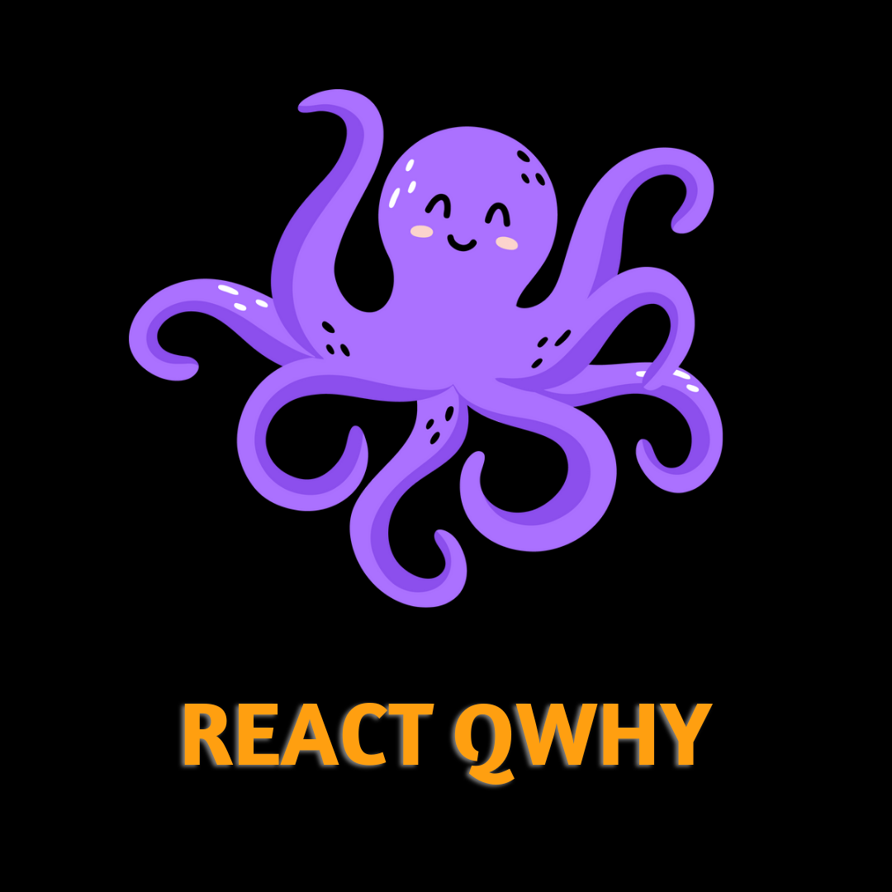

<div align="center">

  
  <h1>React QWhy</h1>
    <p>A React library for fetch data fast and easy!</p>
  <br/>
  
   please give us a star and if you want to contributing we will be grateful to you

<br/>

<!-- Badges -->
<p>
  
  

  

  


</p>

🚧 IMPORTANT 🚧

> ### react-qwhy is not ready to production

  <br/>

  <br/>

<h4>
 <span></span>
    <a href="https://github.com/aliel0malki/react-qwhy">Documentation</a>
  <span> · </span>
    <a href="https://github.com/aliel0malki/react-qwhy/issues/">Report Bug</a>
  <span> · </span>
    <a href="https://github.com/aliel0malki/react-qwhy/issues/">Request Feature</a>
  </h4>
</div>

<br />

<!-- Table of Contents -->

# ⚛️ Table of Contents

- [About the Project](#about-the-project)
- [Tech Stack](#works-on)
- [Features](#features)
- [Getting Started](#getting-started)
  - [Prerequisites](#prerequisites)
  - [Installation](#installation)
- [Usage](#usage)
  - [Return Type](#usequery-return)
  - [Example](#example)
- [Roadmap](#roadmap)
- [Contributing](#contributing)
- [FAQ](#faq)
- [License](#license)
- [Contact](#contact)
- [Acknowledgements](#acknowledgements)

<!-- About the Project -->

## About the Project

I was and still am using react-query, but it is difficult to install and setup the environment, so I thought of building my own library, developing it, and using it in my projects, so react-qwhy appeared.

<!-- TechStack -->

### Works On

  <ul>
    <li><a href="https://react.dev/">REACT</a></li>
    <li><a href="https://nextjs.org/">NEXT JS</a></li>
    <li><a href="https://gatsby.dev/">GATSBY</a></li>
    <li>Any Framework built-on React</li>
  </ul>

<!-- Features -->

### Features

1. Esay to Use 🧠
2. Fully Type Safety 🌀
3. No Providers and all that sh^t 👌
4. Incredibly Fast 🚀
5. Scalable & Timeless in Development 🕛

<!-- Getting Started -->

## Getting Started

<!-- Prerequisites -->

### Prerequisites

Just React Library

<!-- Installation -->

### Installation

Install react-qwhy with npm

```bash
  npm install react-qwhy
```

Install react-qwhy with yarn

```bash
  yarn add react-qwhy
```

Install react-qwhy with pnpm

```bash
  pnpm add react-qwhy
```

<!-- Usage -->

## Usage

Here's how to use **useQuery**

```typescript
import { useQuery } from "react-qwhy";

function yourComponent() {
  ...
  // return params
  const {} = useQuery(qName: string, qFn: Function)
  ...
  return ...;
}
```

## useQuery Return

| Variable    | Return Type                      |
| ----------- | -------------------------------- |
| `status`    | `number`                         |
| `isLoading` | `boolean`                        |
| `error`     | `any`                            |
| `data`      | `<ResultProps[]>` or `undefined` |

## Example

```typescript
import { useQuery } from "../dist/index";

// todo interface //
type TodoProps = {
  userId: number;
  id: number;
  title: string;
  completed: boolean;
};

// fetch function //
const fetchTodos = async () => {
  const req = await fetch("https://jsonplaceholder.typicode.com/todos");
  const res = await req.json();
  return res;
};

function App() {
  /*
   * Fetch todos from [ JsonPlaceholder ]
   * Pass TodoProps as [] to useQuery()
   * Pass a name & query function to useQuery()
   */

  const { data, isLoading } = useQuery<TodoProps[]>("fetch_todos", fetchTodos);

  // When fetch progress, display h1 written in it "loading..." //
  if (isLoading) return <h1>loading...</h1>;

  // return the component //
  return (
    <>
      <ul>
        {data?.map((todo) => (
          <li key={todo.id}>
            <h1>{todo.title}</h1>
            <h5>completed? {todo.completed ? "Yes" : "No"}</h5>
            <h5>{todo.id}</h5>
            <span>{todo.userId}</span>
          </li>
        ))}
      </ul>
    </>
  );
}

export default App;
```

<!-- Roadmap -->

## Roadmap

- [ working on ] useMutation 🔥
- [ X ] State Management 🐐
- [ Y ] Support

<!-- Contributing -->

## Contributing

<a href="https://github.com/aliel0malki/react-qwhy/graphs/contributors">
  
</a>

Contributions are always welcome! 😇

See `contributing.md` for ways to get started.

<!-- FAQ -->

## FAQ

- it's work on react-native?

  - Yes

- why I use this instead of react-query?
  - Use whatever you want. 🤷

<!-- License -->

## License

Distributed under the no License. See LICENSE.txt for more information.

<!-- Contact -->

## Contact

Ali Elmalki - [@npm](https://www.npmjs.com/~alielmalki) - alielmalki.developer@gmail.com

Project Link: [https://github.com/aliel0malki/react-qwhy](https://github.com/aliel0malki/react-qwhy)

<!-- Acknowledgments -->

## Acknowledgements

useful resources and libraries we have used in react-qwhy.

- [React](https://react.dev/)
- [Vite](https://vitejs.dev/)
- [Vitest](https://vitest.dev)
- [RollUp](https://rollup.dev)
